# Audit du dataset Dexed régénéré — compte rendu

Antonin Longeot — dataset complet (30 145 presets), migration DawDreamer + calcul TT/ACTM terminés.

## 1. Contexte

Migration du rendu audio (RenderMan → DawDreamer) terminée, dataset complet régénéré : 120 580 wav +
spectrogrammes. Calcul des descripteurs de timbre (TimbreToolbox + AudioCommons Timbral Models) terminé
sur les 30 145 presets, avec la sélection automatique par corrélation reproduisant exactement la méthode
du papier SpinVAE2 : **6 features ACTM + 32 features TT = 38 features** (`a ∈ R^38`), identique au papier.

## 2. Couverture de l'espace de comportement (Z, 38 features)

PCA : 43.6% de variance expliquée sur 2 composantes — confirme que l'espace est intrinsèquement
multidimensionnel, pas résumable par 2 axes.

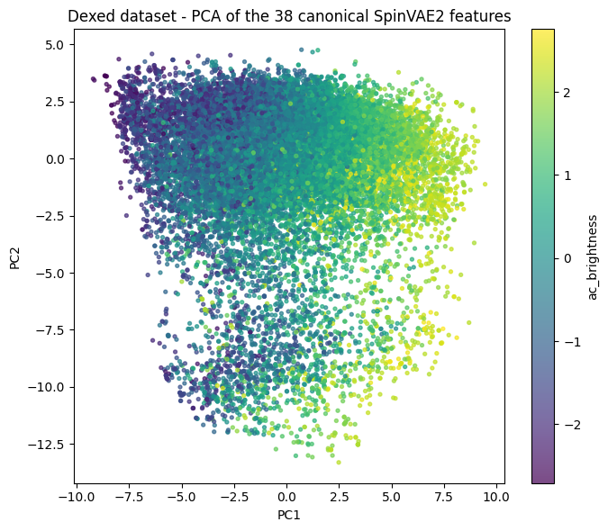

Le gradient de brillance est très propre et continu sur la PCA — la structure principale de l'espace
Z est bien capturée par les deux premières composantes.

UMAP (préserve la structure de voisinage local, contrairement à la PCA) :

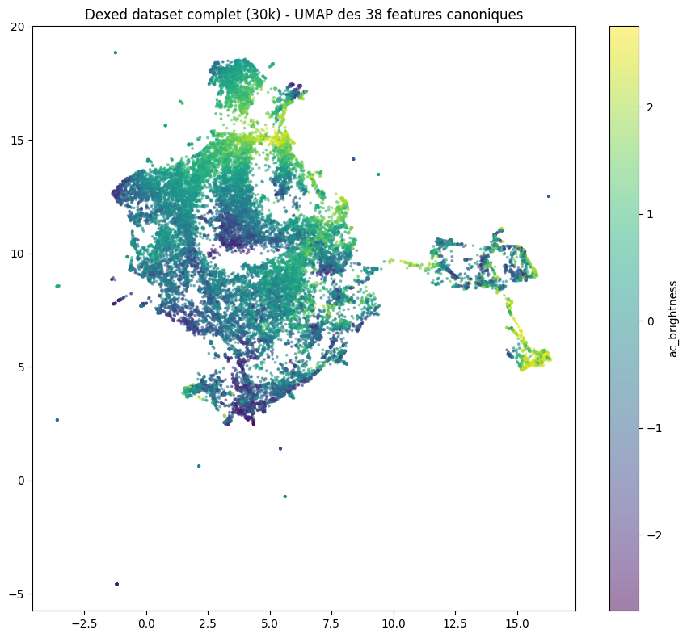

Structure globalement connectée et richement texturée, avec une **excroissance nettement détachée**

(à droite sur la figure) — un groupe de presets très différent du reste, investigué en détail
section 5 (voir plus bas : il s'agit en fait d'un artefact de calcul, pas d'un phénomène acoustique).

Comparaison de deux descripteurs (sémantique `ac_brightness` vs. spectral pur `tt_SpecCent_IQR`) sur
le même embedding :

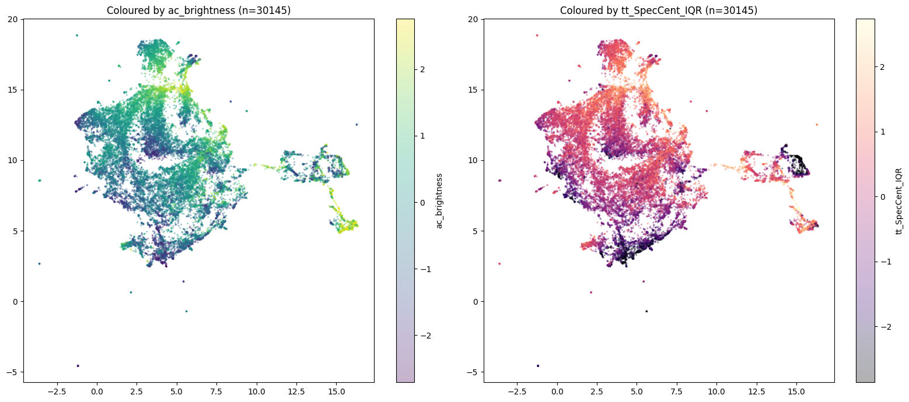

Les deux features s'organisent spatialement de façon très cohérente, y compris sur le groupe détaché —
ce qui confirme que la structure observée n'est pas un artefact d'une seule feature.

**Couverture quantifiée (grille 50×50 sur l'embedding UMAP) : 671/2500 cellules occupées = 26.8%**,
distance moyenne au plus proche voisin = 0.0228.

**Couverture quantifiée directement en 38D natif** (sans passer par une projection 2D, qui n'est pas
une isométrie) : distance moyenne au plus proche voisin = 1.12 (5-NN = 1.80), contre 9.71 (5-NN = 10.21)
pour un nuage uniforme aléatoire de même taille et même boîte englobante — soit un ratio de **0.116**
(0.176 en 5-NN). Le dataset humain occupe donc l'espace de comportement de façon **beaucoup plus
concentrée/clusterisée** qu'un tirage uniforme, confirmant quantitativement ce que l'UMAP suggérait déjà
visuellement, mais sans dépendre d'une projection.

## 3. Comparaison avec l'espace des paramètres bruts (Θ, 155 dimensions)

Même analyse effectuée directement sur les 155 paramètres DX7 bruts, pour comparer la structure de
l'espace de paramètres à celle de l'espace de comportement.

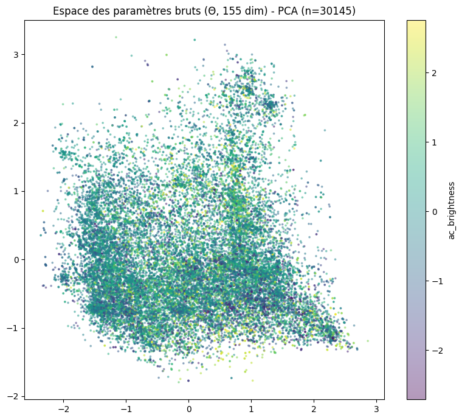

Contraste marqué avec la PCA de Z : le gradient de brillance est ici **complètement mélangé**, sans
organisation spatiale visible — deux presets à paramètres proches peuvent sonner très différemment,
et inversement.

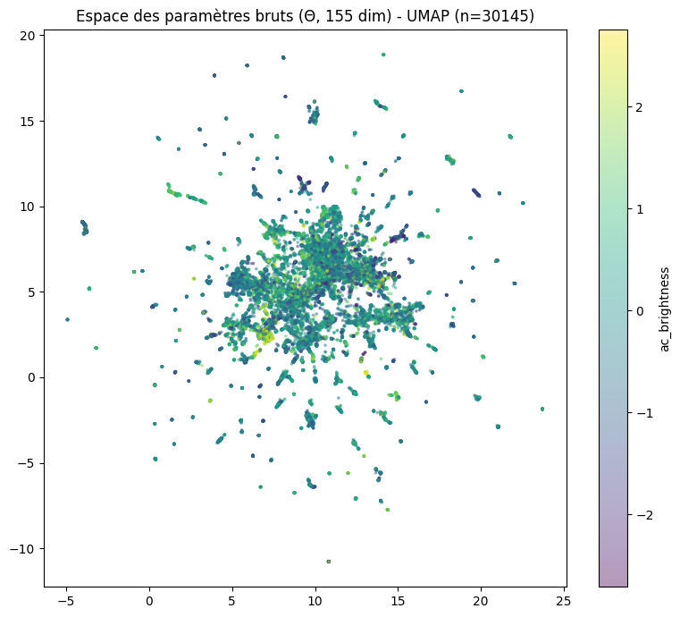

Structure elle aussi très différente de celle de Z : un noyau central dense entouré de nombreux petits
clusters isolés et de points épars, plutôt qu'un continuum connecté.

**Couverture Θ : 513/2500 cellules = 20.5%**, distance moyenne au plus proche voisin = 0.0141.

| | Z (comportement, 38D) | Θ (paramètres, 155D) |
|---|---|---|
| Occupation de grille (50×50) | 26.8% | 20.5% |
| Distance moy. au plus proche voisin | 0.0228 | 0.0141 |

La distance NN plus faible pour Θ malgré une occupation de grille plus faible s'explique probablement
par une structure bimodale (cœur très dense + périphérie éparse), alors que Z est plus uniformément
réparti. Ces différences de structure entre Θ et Z illustrent concrètement la non-linéarité du mapping
Θ→Z que le stage cherche à exploiter.

## 4. Catégorisation des presets par instrument

Pour interpréter les structures observées sur les cartes Z (sections 2, 5, 6), les 30 145 presets
ont été rattachés à une famille d'instrument, en trois étapes.

### 4.1 Catégorisation par mots-clés

Extraction des mots des noms de presets (ex. `BRITE.FULL` → `BRITE`, `FULL`), puis association à
27 catégories (PIANO, BASS, BRASS, STRINGS, SYNTH, ORGAN, GUITAR, BELL, FLUTE, CLAV, VOICE, LEAD,
RHODES, HARP, PERC, SYNTH_VINTAGE, ENSEMBLE, PAD, SAX, DRUM, HIHAT, MARIMBA, TOM, SNARE, CLAP,
BLOCK, KICK) via des listes de mots-clés (avec gestion des ambiguïtés courtes : `STR`, `TOM`, `BS`,
`ENS`... ne matchent qu'en token entier pour éviter les faux positifs du type BOMBS, BOTTOM,
LAMBDA). Cette première passe couvre bien les instruments (PIANO 2106, BASS 1954, BRASS 1687,
STRINGS 1590...) mais laisse **48.1% des presets non catégorisés** (`OTHER`, 14 499/30 145) — noms
trop créatifs, abréviations non listées, ou sound-design pur.

### 4.2 Visualisation sur la carte de comportement (Z)

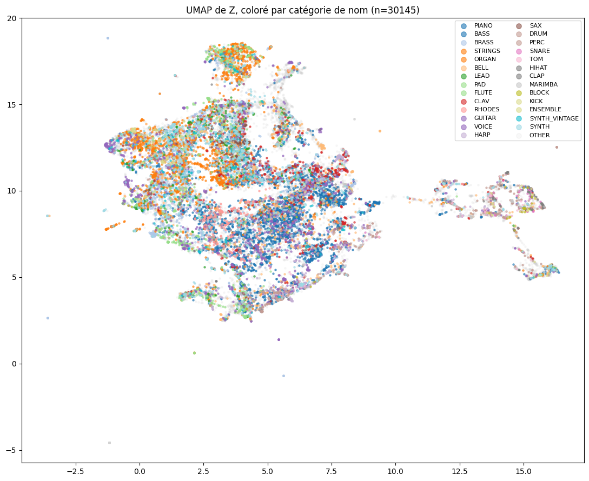

Malgré la proportion élevée d'`OTHER` (en gris clair), les catégories identifiées s'organisent déjà
en régions cohérentes plutôt qu'en un mélange aléatoire — signe que la catégorisation, bien
qu'incomplète, capture une vraie structure timbrale.

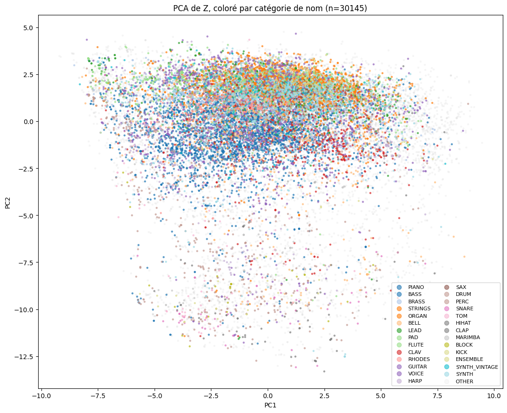

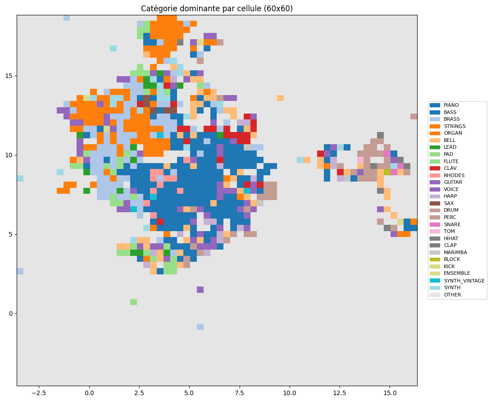

La carte de catégorie dominante par cellule (grille 60×60) confirme la même organisation par
régions, avec des frontières relativement nettes entre familles voisines.

### 4.3 Résorption des `OTHER` par k-NN

Un classifieur **k-NN (k=5, pondéré par distance) entraîné directement dans l'espace natif 38D**
sur les 15 646 presets déjà catégorisés prédit la catégorie des 14 499 presets `OTHER`, en
exploitant l'idée que des presets acoustiquement proches en Z appartiennent probablement à la même
famille d'instrument. **Précision validée à 64.2% en cross-validation à 5 plis** (sur les presets
déjà étiquetés, donc une mesure honnête, pas un chiffre optimiste). Résultat final :
**27 catégories, 0 preset `OTHER` restant**.

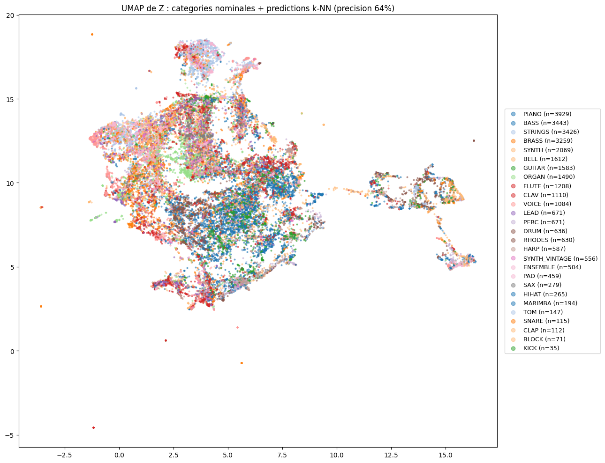

| Catégorie | n | | Catégorie | n |
|---|---|---|---|---|
| PIANO | 3929 | | VOICE | 1084 |
| BASS | 3443 | | LEAD | 671 |
| STRINGS | 3426 | | PERC | 671 |
| BRASS | 3259 | | DRUM | 636 |
| SYNTH | 2069 | | RHODES | 630 |
| BELL | 1612 | | HARP | 587 |
| GUITAR | 1583 | | SYNTH_VINTAGE | 556 |
| ORGAN | 1490 | | ENSEMBLE | 504 |
| FLUTE | 1208 | | PAD | 459 |
| CLAV | 1110 | | SAX / HIHAT / MARIMBA / TOM / SNARE / CLAP / BLOCK / KICK | 279 → 35 |

Cette catégorisation finale (`point_zone_display` dans le notebook) est ensuite utilisée comme
référence pour quantifier la pureté des sous-clusters K-means (section 6) et identifier la
composition de la presqu'île percussive.

## 5. Investigation du groupe détaché : un artefact de calcul, pas un phénomène acoustique

Le groupe détaché repéré sur l'UMAP de Z (section 2) a d'abord été isolé "à la main" par des bornes
codées en dur sur l'embedding — fragile, car dépendant du `random_state` UMAP. Il a été ré-identifié
de façon robuste et reproductible avec **HDBSCAN directement dans l'espace natif 38D** (pas sur la
projection 2D) : **398 presets**, cluster compact (rayon interne 0.45 pour une distance de 11.8 au
centre global — bien un vrai cluster séparé, pas un filament clairsemé).

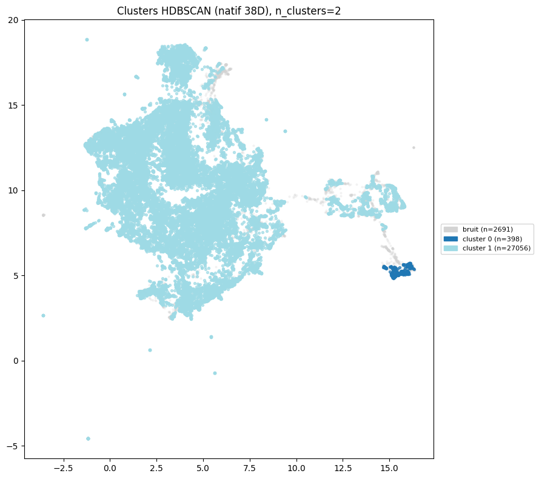

**Cause identifiée** : la feature `tt_F0_med` (fréquence fondamentale médiane) vaut **exactement 0.0
pour les 398 presets, sans aucune exception** (vérifié sur la valeur brute, avant normalisation
log+z-score). Ce n'est pas une propriété acoustique partagée mais un **artefact de repli de
l'extracteur F0 de TimbreToolbox**, qui échoue silencieusement sur des sons non-tonaux/inharmoniques
(noms représentatifs : CYMPLOSION, CRASH CYMB, BOOM-GONG, SPACE NOS2/3, REFS WHISL, EXPLOSION —
essentiellement du sound-design percussif/bruité, cohérent avec 72% de presets classés `OTHER` par
mots-clés). Cette valeur constante crée un "trou" artificiel dans l'espace Z à 38 dimensions et
sépare ces presets de tout le reste — **un biais méthodologique du pipeline de features, pas un vrai
phénomène timbral à explorer davantage**. À noter pour la suite : exclure ou traiter à part les
presets non-tonaux avant toute analyse s'appuyant fortement sur `tt_F0_med`.

## 6. Sous-structure du corps principal (K-means, 38D natif)

Le "corps principal" de l'UMAP (27 056 presets, le reste après retrait du groupe détaché) n'est pas
homogène. HDBSCAN y échoue à trouver une structure fine (72% de bruit) — attendu, HDBSCAN cherche des
îlots séparés par du vide, pas à partitionner un continuum dense. **K-means (k=12, natif 38D)**
partitionne mieux ce cas (tous les points assignés, pas de bruit résiduel) :

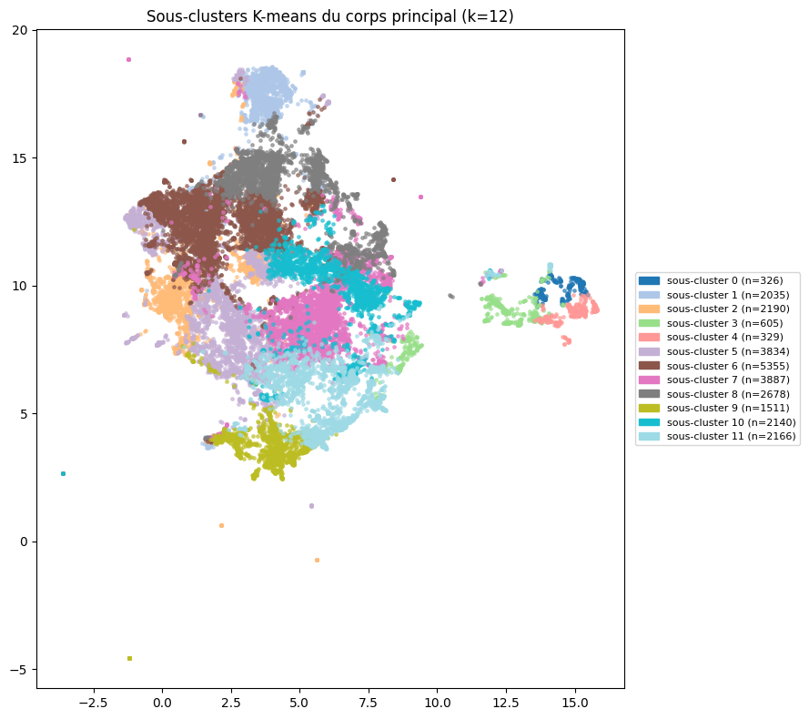

**Score de pureté par sous-cluster** (part de la catégorie majoritaire, via la catégorisation par
mots-clés + k-NN de la section 4, précision validée à 64.2% en cross-validation) :

| Sous-cluster | n | Catégorie dominante | Pureté |
|---|---|---|---|
| 1 | 2035 | STRINGS | **56.6%** |
| 10 | 2140 | BASS | 51.3% |
| 7 | 3887 | PIANO | 46.3% |
| 0 | 326 | DRUM | 30.4% |
| 3 | 605 | DRUM | 28.6% |
| 9 | 1511 | FLUTE | 26.7% |
| 2 | 2190 | BRASS | 24.4% |
| 11 | 2166 | PIANO | 22.7% |
| 6 | 5355 | BRASS | 21.1% |
| 5 | 3834 | PIANO | 20.0% |
| 4 | 329 | DRUM | 14.0% |
| 8 | 2678 | GUITAR | 13.3% |

Le cluster STRINGS/PAD ressort nettement comme le plus homogène de tout le découpage — signature
timbrale 38D visiblement plus séparable que piano/bass/brass, qui se recouvrent beaucoup entre eux
(pureté 13-25% seulement).

**Presqu'île non-tonale/percussive au sein du corps principal** (sous-clusters 0, 3, 4 combinés,
1260 presets, à ne pas confondre avec le groupe détaché de la section 5) :

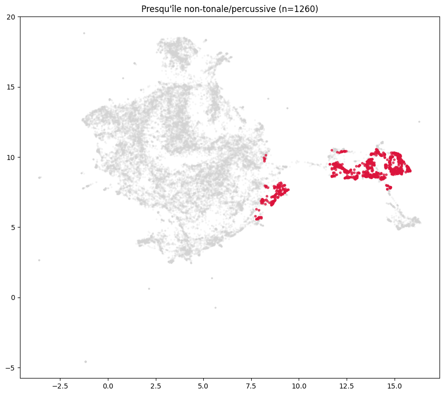

Composition dominée par DRUM (318), BASS (120), PERC (116), TOM (89), MARIMBA (82)... Contrairement
au groupe détaché, ce n'est **pas** un artefact `tt_F0_med` — les features les plus distinctives sont
ici temporelles/d'enveloppe (`tt_SpecDecr_IQR` +3.5σ, `tt_DecSlope` -3.4σ, `tt_RMSEnv_IQR`/`_med`
-3.2σ), cohérent avec une vraie signature de sons percussifs courts et transitoires (attaque rapide,
décroissance abrupte) plutôt qu'un défaut d'extraction.

## 7. Remplacement de MATLAB par `ttb` (port Python de TimbreToolbox)

### 7.1 Motivation

TimbreToolbox (TT) dépendait jusqu'ici de MATLAB, disponible uniquement sur `bonsho` (pas
`gottan`), avec ~20-40s de démarrage par instance — rédhibitoire pour toute boucle itérative
(IMGEP) et contraignant pour le pipeline principal (gestion de zombies MATLAB, blocages déjà
rencontrés). [`geoffroypeeters/ttb`](https://github.com/geoffroypeeters/ttb) est une
réimplémentation Python de TT par Peeters lui-même — un candidat naturel pour s'en affranchir.

### 7.2 Bugs trouvés et corrigés dans `ttb`

Le port contenait 4 bugs réels, corrigés (voir `~/projects/ttb_peeters/peeTimbreToolbox.py`) :
1. **Crash** sur presets à F0 élevée (indices de bin harmonique hors bornes) — corrigé par un
   clip.
2. **`RMSEnv` mal défini** : le port stockait l'enveloppe de Hilbert brute au lieu du vrai RMS
   glissant (fenêtre 23.2ms/hop 2.9ms) que fait MATLAB — corrigé, `RMSEnv` passe de r=0.75 à
   **r=1.000**.
3. **Normalisation d'amplitude par fichier** absente de MATLAB mais présente dans le port —
   supprimée. C'était la cause racine de la plupart des écarts sur les descripteurs en
   amplitude absolue (`RMSEnv`, `HarmErg`).
4. **Axe de fréquence STFT faux** (`sr_hz` jamais multiplié + mauvaise taille de FFT, 512 au
   lieu des 1024 de la config réelle) — corrigé. A fait passer `SpecCent_IQR` de r=0.79 à
   **r=0.997** sur l'échantillon de validation.

### 7.3 Validation feature-par-feature (30 145 presets, dataset complet)

Régénération complète des 32 features TT via `ttb` (`utils/ttb_extractor.py` +
`utils/regenerate_tt_features_ttb.py`, ~82 min, 32 workers, 2 échecs sur presets totalement
silencieux) et comparaison directe aux valeurs MATLAB (voir
`notebooks/dexed_compare_matlab_vs_ttb.ipynb`) :

| Groupe | Features | Corrélation |
|---|---|---|
| Quasi-parfait | `EffDur`, `RMSEnv_med/IQR`, `TempCent`, `Dec`, `Att`, `LAT`, `DecSlope` | r ≥ 0.995 |
| Bon | `SpecCent_IQR`, `SpecVar_med/IQR`, `SpecRollOff_med/IQR`, `F0_med/IQR`, `AmpMod`, `SpecSpread_med/IQR`, `SpecFlat_med`, `SpecCrest_med` | 0.7–0.96 |
| Faible | `HarmErg_IQR`, `InHarm_med/IQR`, `SpecDecr_IQR`, `SpecKurt_med/IQR`, `OddEvenRatio_med/IQR` | 0.01–0.48 |

**11/32 features à r>0.9, 20/32 à r>0.7.**

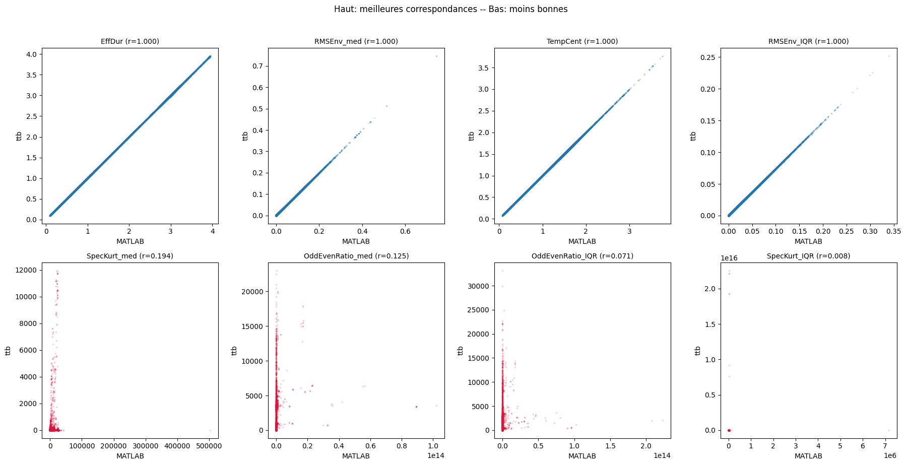

Chaque point est un preset (30 145 au total), axe X = valeur MATLAB, axe Y = valeur `ttb`. En
haut, un alignement quasi parfait sur la diagonale (`EffDur`, `RMSEnv_med`, `TempCent`,
`RMSEnv_IQR`) ; en bas, des nuages beaucoup plus dispersés (`SpecDecr_IQR`, `SpecKurt_med`,
`OddEvenRatio_med/IQR`) — visuellement cohérent avec les r faibles.

Le groupe faible correspond aux descripteurs dérivés du suivi de partiels harmoniques — cause
identifiée : la toolbox MATLAB installée (`VincentPerreault0/timbretoolbox`) utilise un
coefficient d'inharmonicité **variable par frame** avec une fonction objectif corrigée, alors
que `ttb` implémente l'algorithme du **papier JASA 2011 original** (coefficient constant,
fonction non corrigée) — une différence algorithmique structurelle et documentée, pas un bug
de portage.

### 7.4 Comparaison structurelle (avant/après)

Malgré ces écarts feature-par-feature, les métriques globales de couverture restent proches :

| Métrique | MATLAB | ttb |
|---|---|---|
| PCA variance expliquée (2 comp.) | 46.0% | 47.6% |
| UMAP grid occupancy (50×50) | 26.8% | 22.2% |
| Native 38D ratio NN / uniforme aléatoire | 0.116 | 0.107 |
| k-NN catégorisation (précision CV) | 64.2% | 64.3% |
| HDBSCAN — îlots détachés | 1 (n=398) | **2** (n=514 + n=460) |

**PCA de Z, coloré par `ac_brightness`** — MATLAB à gauche, `ttb` à droite :

<table><tr>
<td></td>
<td>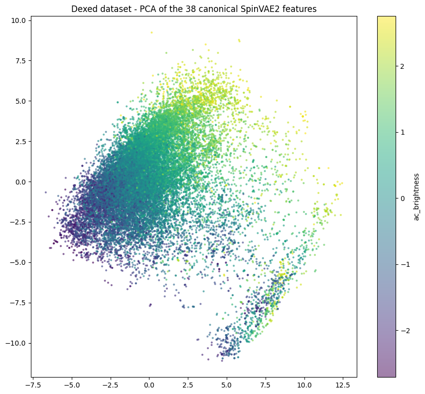</td>
</tr></table>

Même gradient de brillance, même structure générale — la PCA n'est pas notablement affectée
par le changement de toolbox TT.

**UMAP de Z, coloré par `ac_brightness`** — MATLAB à gauche, `ttb` à droite :

<table><tr>
<td></td>
<td>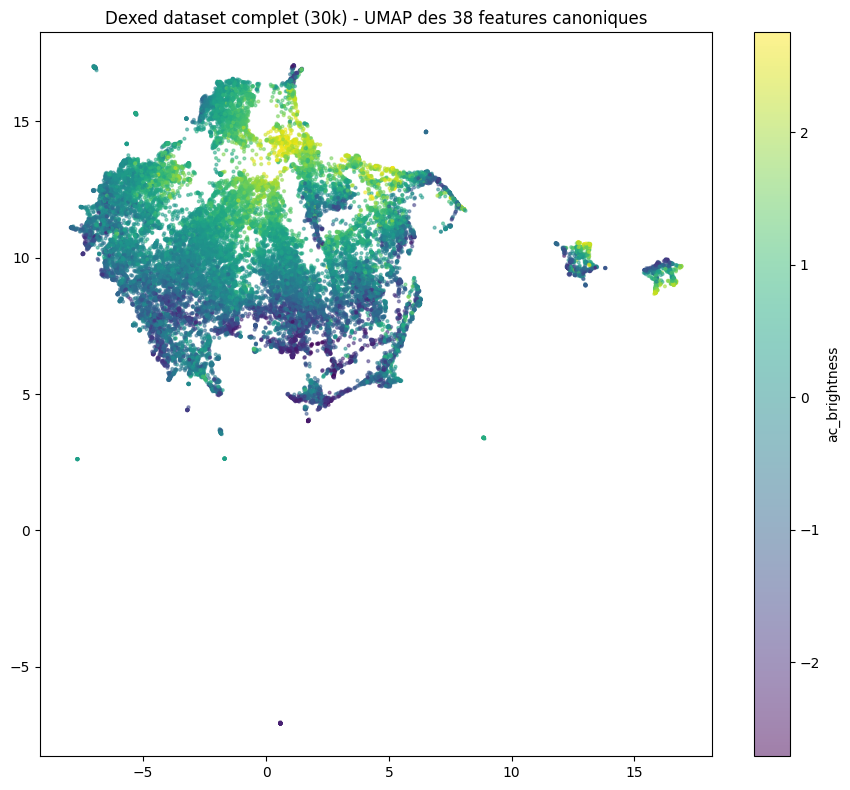</td>
</tr></table>

Structure globale très similaire dans les deux cas — même organisation générale du nuage de
points, mêmes zones denses/éparses.

**HDBSCAN, groupe(s) détaché(s)** — MATLAB (1 îlot) à gauche, `ttb` (2 îlots) à droite :

<table><tr>
<td></td>
<td>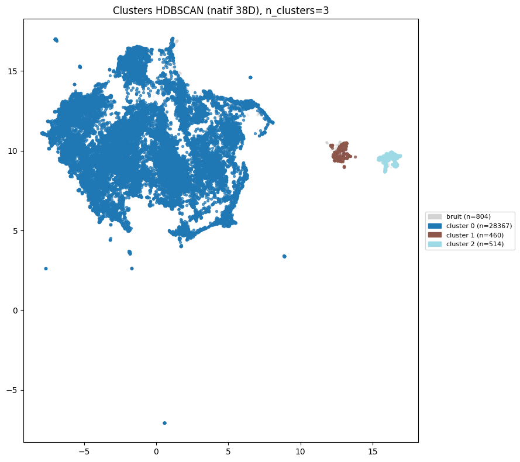</td>
</tr></table>

C'est la différence structurelle la plus visible : `ttb` sépare en deux ce qui n'était qu'un
seul groupe avec MATLAB — deux sous-familles percussives (percussion pure/bruitée — snare,
clap, cymbale — vs percussion semi-mélodique — tom, marimba, xylophone) que MATLAB ne
distinguait pas. Le même artefact `tt_F0_med` est confirmé sur les deux îlots (plancher à
45.0 Hz au lieu de 0.0 avec MATLAB — valeur de repli différente, même phénomène sous-jacent).

**Sous-clustering K-means du corps principal** — MATLAB à gauche, `ttb` à droite :

<table><tr>
<td></td>
<td>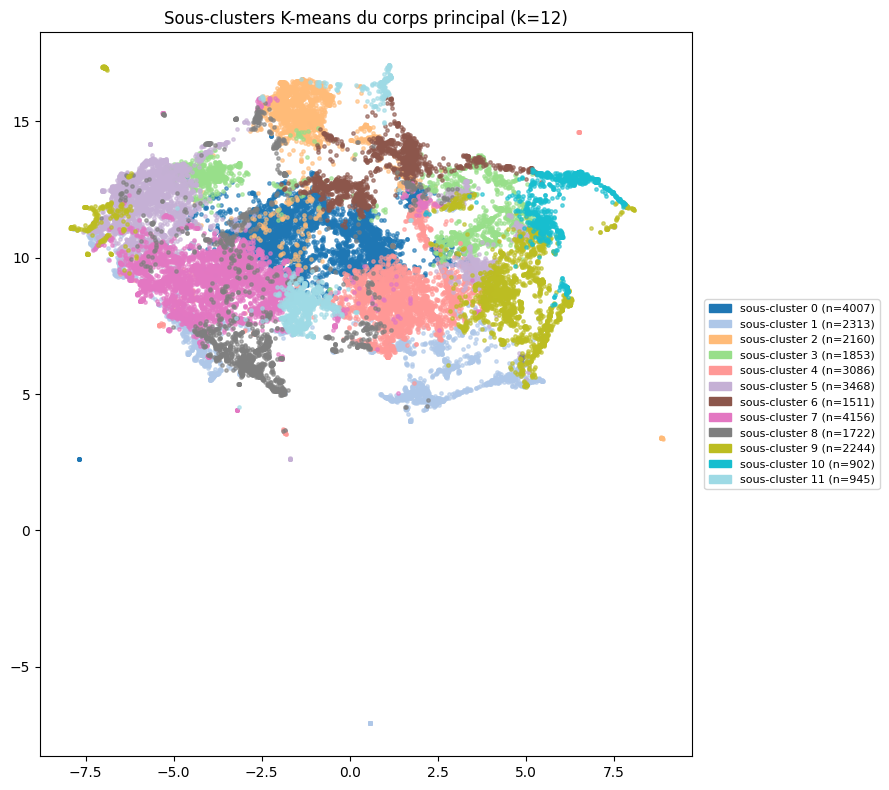</td>
</tr></table>

Découpage globalement comparable (blob principal partitionné en régions par instrument), mais
pas comparable sous-cluster par sous-cluster : K-means numérote arbitrairement d'une run à
l'autre, donc "sous-cluster 3" sur MATLAB n'a aucun rapport avec "sous-cluster 3" sur `ttb`
(cf. section 6 et notebook `ttb`). Le résidu percussif identifié dans le corps principal
(section 6 pour MATLAB, notebook `ttb` section 14.4) n'est volontairement pas illustré ici :
sur MATLAB c'était une vraie presqu'île reliée au groupe détaché (1260 presets), alors que sur
`ttb` c'est un résidu isolé bien plus petit (902 presets) qui ne rejoint plus les 2 îlots —
les deux ne sont plus comparables sous un même intitulé "presqu'île". Détail complet dans
`notebooks/dexed_audit_TT_ACTM_ttb.ipynb`.

### 7.5 Recommandation d'usage

`ttb` est fiable pour toute analyse structurelle/de couverture globale (remplace MATLAB sans
perte notable). Pour une analyse fine s'appuyant spécifiquement sur `F0`/`InHarm`/`HarmErg`/
`OddEvenRatio`/`SpecKurt`, rester prudent ou continuer à utiliser les valeurs MATLAB
existantes.

## 8. Intégration adtool (IMGEP) — état actuel

Les 3 briques adtool (`DexedParameterMap`, `DexedSimulation`, `DexedStatistics`) sont
construites, testées de bout en bout, et **`DexedStatistics` calcule désormais l'espace Z à
38D complet** (6 ACTM + 32 TT via `ttb`, plus seulement ACTM) — directement comparable à la
baseline humaine ci-dessus. Coût mesuré : ~11-13s/évaluation en 38D (contre ~1.5s pour ACTM
seul) — la boucle IMGEP n'est plus "gratuite", à budgéter en conséquence pour les grosses
expériences. Une première expérience de 150 itérations en 38D a été menée
(`adtool/examples/dexed/run_150_38D/`). Notebook d'exploration :
`adtool/examples/dexed/dexed_adtool_overview.ipynb`.

## 9. Prochaines étapes

- Comparer rigoureusement la couverture d'une exploration IMGEP à la baseline humaine 38D
  ci-dessus (grid occupancy, mean NN distance, même méthodologie) — désormais possible
  directement, même espace de features des deux côtés.
- Traiter le biais `tt_F0_med` (section 5, confirmé aussi sur `ttb` en section 7.4) avant toute
  nouvelle analyse s'appuyant dessus : exclure ou isoler les presets non-tonaux, ou recalculer
  une F0 plus robuste pour ces cas.
- Écouter un échantillon de la presqu'île percussive (section 6) et des 2 îlots `ttb` (section
  7.4) pour confirmer/affiner l'interprétation temporelle/d'enveloppe.
- Lancer une expérience IMGEP à plus grande échelle (budgéter le coût ~11-13s/évaluation en
  38D, cf. section 8) pour obtenir une comparaison de couverture statistiquement robuste.
